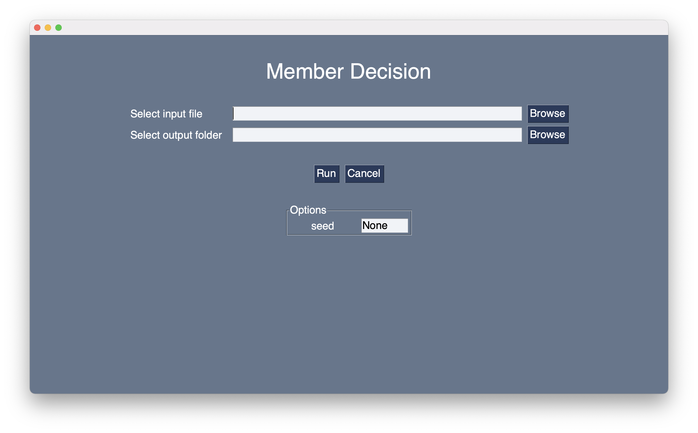

# Member Decision

## Install
You can install OS X app [here](https://github.com/yu-9824/member_decision/releases).

## How to use
You will need to use a template like the one shown in the [example](example). 
We also show you the results of running the program in the [example](example).

That way, you can automatically draw lots considering the schedules of "Gomisute" and "Kagishime" with reproducibility. 
- You can get `seed` to reproduce.
- When `seed` is None, the lottery is completely random. When `seed` is an arbitrary integer, the lottery is conducted to check for reproduction. (Even if you set seed to None, you don't need to worry about it because you can get the automatically generated seed as a "seed.txt" file.

### Images

## LICENSE
See [LICENSE](https://github.com/yu-9824/member_decision/tree/main/LICENSE).